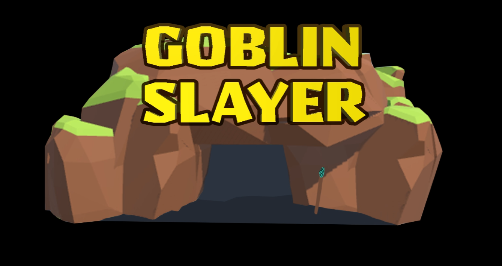

# CS6457 Globin Slayers Alpha Video

Unity build files for the 3D game my talented team and I worked on for OMSCS' CS6457 - Video Game Design. No homework files or specific scripts are provided as per honorcode policy. The files shared are for portfolio purposes only.

[](https://youtu.be/iCUDcjn7Qqw)

# Controls
```
Keyboard and Mouse:
	WASD – Move Goblin Slayer​
	Mouse - Turn Camera/View
	Space – Roll​
	T – Interact with Traps​
	Mouse1 – Fire Weapon​ / Menu Select
	Escape - Pause Menu​
 Controller:
	Left Analog – Move Goblin Slayer​
	Right Analog - Turn Camera/View​
	South-Button  – Roll​ / Menu Select
	North-Button– Interact with Traps​
	East-Button – Fire Weapon​
	Start Button - Pause Menu​
```
 
# Contact
Add a new issue, or drop me an e-mail at yingzheloh@gmail.com. 
